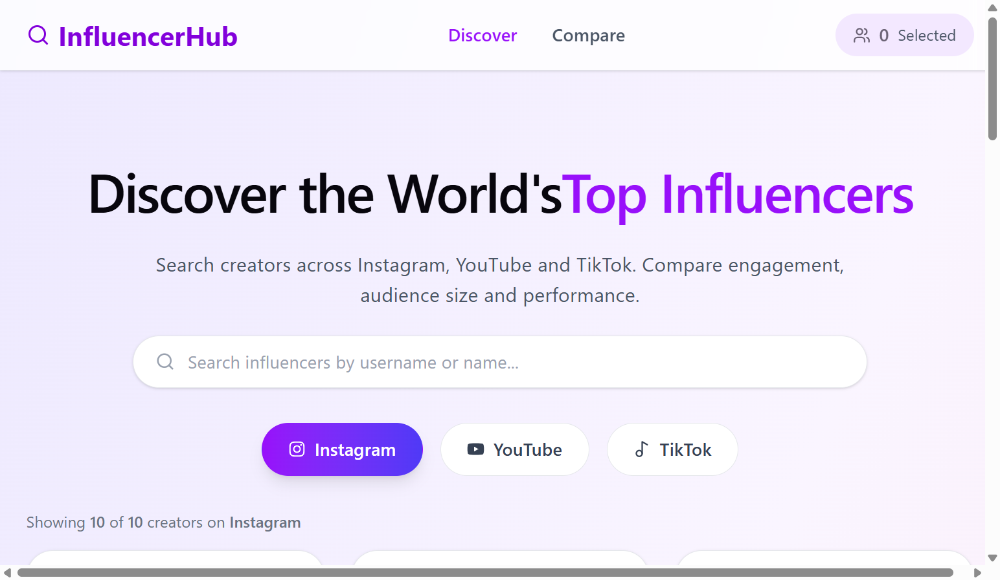
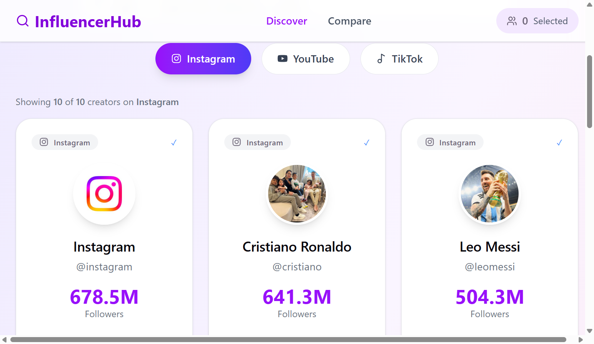
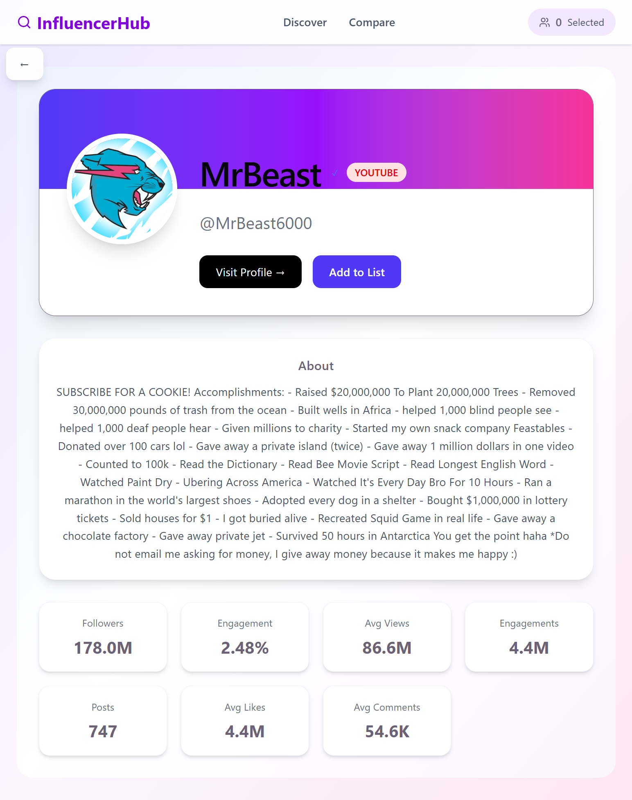
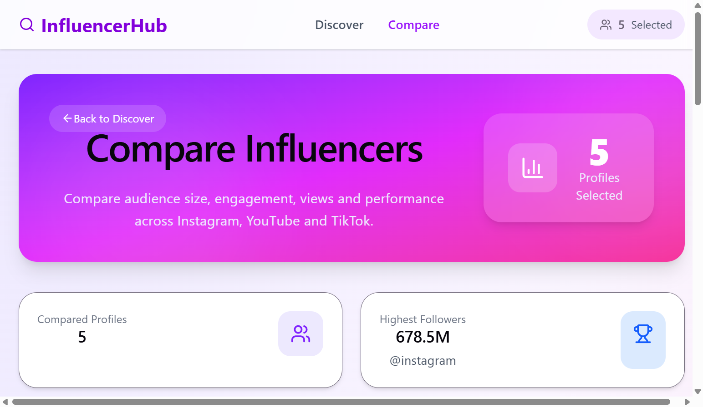

# Influencer Search Platform

A modern Influencer Discovery Platform built using **React 19**, **TypeScript**, **Vite**, **Tailwind CSS**, and **Zustand**.

The application allows users to browse influencers from **Instagram**, **YouTube**, and **TikTok**, search creators, view detailed analytics, create a comparison list, and compare influencers side-by-side.

---
## Table of Contents

- Live Demo
- Screenshots
- Tech Stack
- Features
- Project Structure
- Library Added
- Assumptions
- Trade-offs
- State Management
- Data Flow
- Improvements Made
- Challenges
- Approach
- Future Improvements
- Testing
- Installation
- Deployment

# Live Demo

🔗 https://vibe-coder-assignment-main.vercel.app/

---

# Screenshots

## Home Page

<p align="center">
  
</p>
<p align="center">
  
</p>
---

## Profile Detail

<p align="center">
  
</p>

---

## Compare Page

<p align="center">
  
</p>

---

## Mobile View

<p align="center">
  
</p>
<p align="center">
  
</p>

---

# Tech Stack

- React 19
- TypeScript
- Vite
- Tailwind CSS
- Zustand
- React Router
- Lucide Icons

---

# Project Structure

The project follows a **feature-based architecture** instead of grouping files purely by type.

```
src
│
├── app/                 # Application routing and providers
│
├── assets/
│   ├── data/
│   │   ├── profiles/
│   │   └── search/
│   └── images/
│
├── components/
│   ├── common/
│   │      Layout
│   │      Navbar
│   │      SearchBar
│   │      VerifiedBadge
│   │
│   ├── profile/
│   │      ProfileCard
│   │      ProfileList
│   │      SelectedSidebar
│   │
│   └── compare/
│          CompareTable
│          CompareStats
│          CompareProfileCard
│          EmptyCompare
│
├── features/
│   ├── search/
│   ├── profile/
│   └── compare/
│
├── pages/
│      SearchPage
│      ProfileDetailPage
│      ComparePage
│
├── store/
│      Zustand Store
│
├── types/
│
├── utils/
│
└── main.tsx
```

---
# Libraries Added

| Library | Purpose |
|----------|----------|
| Zustand | Global state management |
| React Router DOM | Routing |
| Lucide React | Icons |
| Tailwind CSS | Styling |

## Removed:
 react-beautiful-dnd

# Assumptions

- Search JSON acts as the primary data source.
- Detailed profile JSON files may not exist for every creator.
- When detailed profile data is unavailable, the application falls back to summary search data.
- Comparison state is stored locally using Zustand.
- Analytics displayed are based only on the provided dataset.

# Trade-offs

- Local JSON files were used instead of an API.
- Comparison data is not persisted after refresh.
- Some creators have limited analytics due to incomplete datasets.
- Charts are currently placeholders because historical metrics were unavailable.

# Features

## Discover Influencers

- Browse creators from Instagram
- Browse creators from YouTube
- Browse creators from TikTok
- Responsive search
- Platform switching
- Responsive cards

---

## Profile Detail

Displays:

- Profile Image
- Username
- Full Name
- Followers
- Engagement Rate
- Average Views
- Average Likes
- Average Comments
- Description
- Verified Status
- External Platform Link

---

## Compare

Users can

- Add profiles
- Remove profiles
- Compare multiple creators
- View statistics
- Side-by-side comparison table

---

## Responsive Design

Optimized for

- Desktop
- Tablet
- Mobile

---

# State Management

The project uses **Zustand** for global state.

Current global state includes

- Selected Profiles
- Add Profile
- Remove Profile
- Clear Profiles

This avoids unnecessary prop drilling.

---

# Data Flow

```
Search JSON
      │
      ▼
extractProfiles()
      │
      ▼
filterProfiles()
      │
      ▼
Search Page
      │
      ▼
Profile Card
      │
      ▼
Profile Detail
      │
      ▼
Compare Store
      │
      ▼
Compare Page
```

---

# Improvements Made

The original assignment contained multiple issues and incomplete implementations.

The following improvements were made.

---

## 1. Removed react-beautiful-dnd

The original implementation depended on

```
react-beautiful-dnd
```

which is no longer compatible with React 19.

Removed the dependency to avoid runtime errors.

---

## 2. Fixed stale React state

Original

```ts
setClickCount(clickCount + 1);

console.log(clickCount);
```

This logged stale values because the SearchPage component was remounted whenever the user navigated back from the profile detail page, the click counter was recreated on every mount.

Updated using

The click tracking was moved to the global Zustand store.

Implemented:

Persistent click tracking
Individual click count for every profile
Helper functions for incrementing, retrieving and resetting counts
```
profileClicks: Record<string, number>

incrementProfileClick(username)

getProfileClickCount(username)

resetProfileClick(username)

resetAllProfileClicks()

```

---

## 3. Improved Search Logic

The original search only searched

- username

Many datasets contained

- handle
- custom_name

instead of username.

Search now checks

- username
- fullname
- handle
- custom_name

making search consistent across all three platforms.

---

## 4. Case-insensitive Search

Search now ignores capitalization.

Example

```
MrBeast

mrbeast

MRBEAST
```

all return the same result.

---

## 5. Fixed Engagement Rate

Original project displayed incorrect engagement values.

Correct calculation

```
engagement_rate × 100
```

instead of

```
engagement_rate × 10000
```

---

## 6. Fixed Profile Detail Loading

Original implementation expected

```
username.json
```

to exist for every profile.

Only a handful of JSON files existed.

Many creators therefore failed to open.

New implementation

- searches profile JSON first
- falls back to search dataset
- matches using

```
username
handle
fullname
```

Result:

Almost every listed creator now opens successfully.

---

## 7. Added Fallback Data

If detailed analytics are unavailable,

the page now loads basic information from search datasets.

Users no longer encounter broken pages.

---

## 8. Fixed Add to List

Previously

```
Add to List
```

always remained disabled.

Now

- button updates immediately
- reflects Zustand state
- changes to

```
Added ✓
```

after selection.

---

## 9. Created Compare Page

The original assignment did not include a complete comparison feature.

Implemented

- Compare Hero
- Stats Cards
- Comparison Table
- Empty State
- Clear All functionality

---

## 10. Redesigned Search Page

Added

- Hero Banner
- Better spacing
- Gradient background
- Responsive layout
- Improved typography

---

## 11. Redesigned Profile Detail Page

Completely rebuilt UI

including

- Hero Section
- Analytics Cards
- Responsive Grid
- Sticky Back Button
- Modern styling

---

## 12. Improved Navigation

Added

- Responsive Navbar
- Compare Page Link
- Selected Profile Counter

---

## 13. Improved Sidebar

Selected influencers now persist using Zustand and remain synchronized throughout the application.

---

## 14. Fixed TypeScript Errors

Resolved multiple issues including

- casing mismatch imports
- deprecated configuration
- missing helper functions
- missing handlers
- incompatible JSON typing
- profile loader typing

---

## 15. Better Folder Organization

Reorganized project into a feature-based structure.

Benefits include

- easier maintenance
- improved scalability
- cleaner separation of concerns

---

# Challenges Faced

The biggest challenge was the inconsistency of the provided datasets.

Examples included

- missing usernames
- different naming conventions
- incomplete profile details
- inconsistent engagement fields
- partial analytics
- missing profile JSON files

Instead of assuming a uniform data format, the application was designed with fallback strategies to ensure graceful handling of incomplete data.

---

# Approach

The goal was not only to complete the missing features but also to improve the overall maintainability of the project.

The implementation followed these principles:

- Build reusable components
- Centralize global state using Zustand
- Separate UI from business logic
- Handle incomplete datasets gracefully
- Keep TypeScript strictly typed
- Design for responsiveness
- Use feature-based organization for scalability

---

# Future Improvements

- API integration instead of local JSON
- Infinite scrolling
- Sorting
- Advanced filters
- Charts
- Dark Mode
- Authentication
- Saved comparison lists
- Pagination
- Performance optimization using React Query

---
# Testing

The application was manually tested for:

- Search functionality
- Platform switching
- Profile detail loading
- Add/Remove compare list
- Responsive layout
- Invalid profile fallback
- Navigation

# Performance Considerations

- Lazy loaded profile JSON files using import.meta.glob().
- Zustand prevents unnecessary prop drilling.
- Search filters are computed in-memory for the current dataset.

# Installation

Clone the repository

```bash
git clone https://github.com/ManjotSingh06/vibe-coder-assignment-main
```

Install dependencies

```bash
npm install
```

Run locally

```bash
npm run dev
```

Build

```bash
npm run build
```

---

# Deployment

The application is deployed using **Vercel**.

Live URL

```
https://vibe-coder-assignment-main.vercel.app/
```

---

# Author

**Manjot Singh**

GitHub

https://github.com/ManjotSingh06